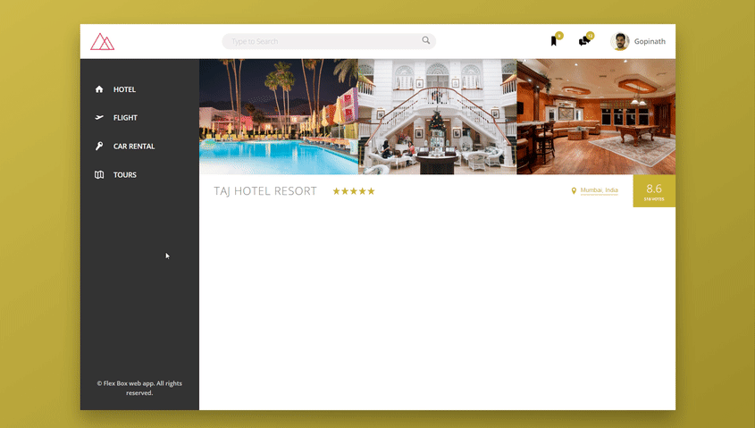

# css-flexbox
The project has created to develop a small webpage using CSS flexbox properties.

 
 The UI implementation of this project is done using CSS Flexbox properties.
 Following are the flexbox properties.

## CSS Flexbox Properties

### Container Properties

These properties are used in the container block.

`flex-direction`
`justify-content`
`align-items`
`flex-wrap`

### Item properties:

`align-self`
`flex : flex-grow flex-shrink flex-size`

### SVG Images
icomoon.io
